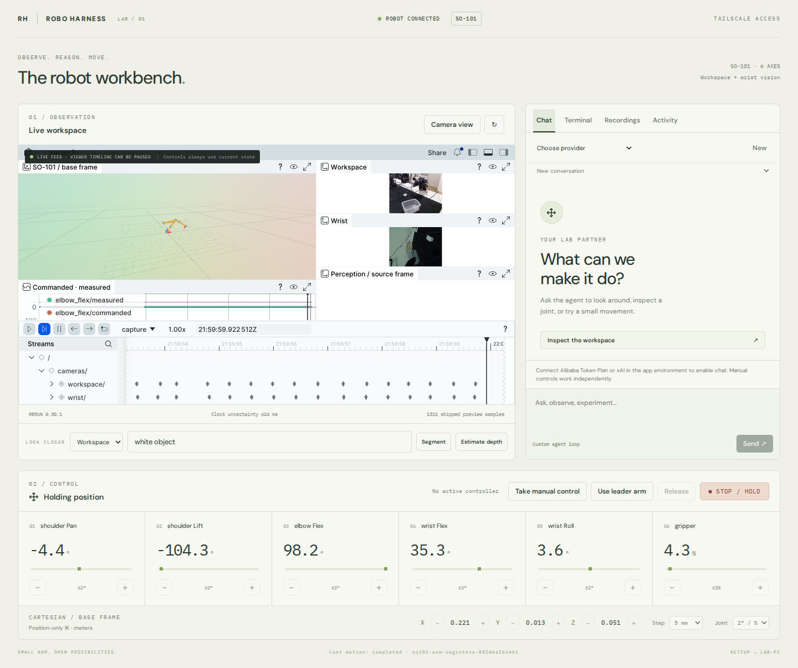

# Robo Harness

A standalone SO-101 playground: a custom agent loop, Rerun as the main visual workspace, explicit robot tools, and a LeRobot hardware boundary.

The lab deployment is live at **http://100.105.51.45:8940**, using the real SO-101 and both Pi cameras, with no operator login. See [deployment and measured acceptance](docs/real-arm-preflight.md).

A fresh checkout defaults to mock hardware with synthetic cameras. This machine has a local `.env` pointing at the Pi; normal development commands here use that configured endpoint.



See [validation evidence and remaining configuration](docs/validation.md).

## Run it

Requires Bun, Python 3.12, uv, and a browser with WebGL2 or WebGPU.

```sh
bun install
uv sync --extra dev
bun run build
bun run dev
```

Open **http://127.0.0.1:5178**. The application also serves the built workbench on **http://127.0.0.1:8940**. Tailscale access is the default: the workbench opens without a token or login. Rerun's viewer and stream bind only to loopback on 8942/8943 and are proxied through the application. Set `ROBO_ACCESS_MODE=token` only if you explicitly want the optional login mode.

For access from another tailnet machine, build first and start with `ROBO_HOST=100.105.51.45 bun run dev`, then use `http://100.105.51.45:8940`. The bind address must belong to this host. Public internet binding is deliberately refused.

`bun run dev` runs the app, Rerun worker, and Vite. With local I/O it also starts the mock service. Set `ROBO_IO_URL` to the Pi endpoint to use its real hardware service; no local mock is started for a remote endpoint. The supervisor shuts down its child process groups on exit.

## Use the workbench

1. Take manual control. Jog joints/gripper or Cartesian XYZ in the base frame.
2. Stop/hold cancels movement and revokes control. Release returns to holding.
3. Leader teleoperation becomes available only on commissioned real hardware.
4. Configure a model provider in `.env` to chat. Chat supervises each bounded move through acquisition, renewal, measured completion and release; it cannot take over human control. The model picker shows effective camera-image support. Optional tools are enabled through discovery; see [the chat action decision](docs/decisions/0004-supervised-chat-motion.md) for configuration and recovery behavior.
5. Decision runs (`bun run jev`) let an evaluation model or rules baseline pick bounded joint steps; chat and a decision run never move the arm at the same time.
6. Use Recordings to capture observations, actions, code references, and Rerun replay. Replay is historical; manual controls always refer to live state.
7. Configure a perception worker and a conservative per-request charge, then approve an aggregate spending cap in Activity. Segmentation/depth stay off until both are configured.

Rerun includes robot geometry, frames, camera streams, proposed paths, joint plots, and a capture timeline. The arm display uses the lab's mesh-free URDF as a kinematic skeleton; it is not a physics simulator or a full collision model. Estimated depth is labeled relative unless the backend explicitly supplies calibrated metric depth.

The iframe's internal timeline can be paused independently. The persistent label makes this explicit; the control deck remains live. A telemetry-worker failure exposes lightweight live cameras instead.

## Providers

Alibaba Token Plan uses its compatible API through our own loop. xAI uses an API key or an explicitly configured Grok auth file, reread for each request. The Grok CLI remains the sole owner of token refresh; this app will not rotate or copy its refresh token. On netcup both providers are pointed at the cliproxy gateway (`ROBO_ALIBABA_URL` / `ROBO_XAI_URL` = `http://127.0.0.1:8317/v1`, key `CLIPROXY_API_KEY_ROBO`); documented image support carries over to the gateway host.

Claude and Codex subscription adapters are visibly unavailable until their direct custom-loop route is verified. External Claude/Codex agents can use the MCP server now. There is no substitution of native agent runtimes for the custom loop.

The model loop supports streaming, tool execution, observation images, steering, cancellation, persisted conversations, bounded step counts, and basic complete-turn context trimming. Provider errors are redacted before reaching the journal.

TypeSafe's Jev (`typesafe-ai/jev`) is an evaluation model, not a chat provider: the decision runner calls it through the AI SDK `experimental_evaluate` API on Vercel AI Gateway with `AI_GATEWAY_API_KEY` (paid Gateway credits; free credits exclude it, and zero data retention is opt-in with `ROBO_JEV_ZDR=1` on Pro/Enterprise plans). Cumulative spend is capped by `ROBO_JEV_BUDGET_USD` (default 10). The optional scene describer for pickup runs uses an OpenAI-compatible endpoint (cliproxy by default, `ROBO_SCENE_*`, falling back to `CLIPROXY_API_KEY`).

See `.env.example` for configuration. Credentials from Invok are not imported automatically.

## Programmatic control

Set `ROBO_URL` for the CLI, MCP server, or Python client. No token is required in Tailscale mode. `ROBO_CONTROLLER` distinguishes independent external agents, which retain agent control semantics. In optional token mode, use `ROBO_TOKEN` with `var/agent-token`.

```sh
bun run cli observe
bun run cli acquire '{"mode":"agent"}'
bun run cli move '{"request_id":"my-unique-command","target":{"shoulder_pan":1},"duration_s":1}'
bun run cli operation '{"id":"operation-id-from-move"}'
bun run cli release
```

A lease lasts three seconds. Renew deliberately while controlling; expiry cancels unfinished motion. Degrees apply to arm joints, percent to the gripper, and meters to Cartesian positions. Accepted means queued, not reached. Poll the operation for measured completion.

Use [the ready MCP configuration](examples/mcp.json) on this machine, or configure command `bun`, arguments `["/home/kristjan/code/robo-harness/apps/cli/src/mcp.ts"]`, and `ROBO_URL=http://100.105.51.45:8940`. Capture tools return actual MCP image blocks. Set a distinct `ROBO_CONTROLLER` per concurrent agent.

Decision runs are driven from `bun run jev` (a thin coordinator client; see [decision 0011](docs/decisions/0011-decision-runner.md)):

```sh
bun run jev --smoke [--mock]                       # Gateway proof, no robot
bun run jev --observe [--task T] [--goal G]        # read-only state + candidate steps
bun run jev --fixtures --strategy choice|parallel|critic|rules [--mock]
bun run jev --dry-run --strategy critic --max-steps 5
bun run jev --execute --supervised --strategy choice --max-steps 20 --max-seconds 60   # real arm: operator present
```

Goals use `joint+=N` / `joint-=N` (relative) and `joint=N` (absolute). Each run writes `decision.*` events and a JSONL log under `ROBO_DATA_DIR/decision-runs/`.

The Python client is `robo_harness.client.Robot`. Its context manager acquires/releases control, and `move()` renews the lease while awaiting measured completion. See `examples/inspect_and_nudge.py`.

## Development shells

Build the local development image:

```sh
docker build -f deploy/dev.Dockerfile -t robo-harness-dev:local .
```

Open **Terminal → Open terminal** for an interactive Bash shell, Python REPL, terminal applications, Ctrl-C, and automatic resizing. Leaving the tab or briefly losing the connection retains the shell; returning restores its recent output. **Close terminal** ends the container. Files in `/workspace` persist for the same browser controller. Sessions close after ten minutes without input or one hour total; coordinator restart also closes them. **Run a single command** retains the existing Netcup/Pi command runner.

The interactive terminal uses `Bun.Terminal` on the coordinator and `ghostty-web` (Ghostty's WASM parser) in the browser, following the same transport/rendering pattern as Invok without importing it. Interactive terminals always use bridge networking.

The terminal and agent shell run in a container with only their task workspace mounted. They receive a short-lived program credential, no provider or hardware-service credentials, no Docker socket, and no motor devices. The container runs on Docker's bridge network and reaches the authenticated API through `ROBO_PROGRAM_URL`, which defaults to the tailnet bind address; `ROBO_SHELL_NETWORK=host` is a development-only escape hatch for a loopback-bound server with mock hardware. CPU, memory, process count, output size, and command duration are bounded. Python programs import `Robot` from `robo_client` in this image.

Optional Pi development uses an explicitly configured dedicated SSH account and `deploy/robo-dev-shell`. That account must have no sudo, no device groups, no production secret access, and no write access to the deployed service or reviewed profile. Dependency installation belongs in its own virtual environment. Provisioning this account is a separate reviewed deployment step.

## Recordings and LeRobot

Raw captures live under `var/recordings/<id>` and preserve original capture timestamps, clock-domain information, camera JPEGs, measured/commanded joints, events, and the geometry hash. Rerun writes `replay.rrd` independently. An interrupted or incomplete capture is marked and is refused by the native exporter.

With LeRobot 0.6.0 installed:

```sh
robo-export var/recordings/RECORDING_ID /path/to/new-dataset --repo-id local/so101-playground
```

The exporter uses `LeRobotDataset.create`, `add_frame`, `save_episode`, and `finalize`; it does not upload anything. Export resamples the recorded time axis to the declared dataset frame rate and preserves raw timing in the source artifacts. These exploratory recordings are not automatically labeled expert training demonstrations.

Netcup is the primary recording store. The current Pi SSD is not mounted; no disk spool on the Pi is assumed. Camera buffers are bounded and in memory. Disk pressure ends capture explicitly, preserving the root-filesystem reserve.

## Tabletop calibration

Use `uv run robo-calibrate --help` to prepare a saved workspace frame, fit measured plane coordinates, and evaluate held-out points. Each run saves calibration evidence and a camera overlay; it does not enable robot motion. See the [measurement procedure](docs/tabletop-calibration.md).

## Hardware deployment

The lab runs the systemd units from this `main` working tree (no worktree or branch); config and provider credentials live in `~/.config/robo-harness.env` and data under `ROBO_DATA_DIR`. A promotion is `bun run build` plus `systemctl --user restart robo-app robo-rerun`; see [deployment](docs/real-arm-preflight.md). The deployed rig uses [config/robot.lab-pi.json](config/robot.lab-pi.json); [config/robot.example.json](config/robot.example.json) remains mock-only. Real MCP movement, stop/hold, both cameras, recording/replay, and container observations were verified on 2026-09-06/07. On 2026-09-17 the profile gained per-joint position gains (P=32 on arm joints) after a servo trace showed LeRobot's P=16 dead band, and the control smoke passed on the real arm with the rules baseline and Jev; see [the acceptance record](docs/acceptance-2026-09-17-jev-decision.md). The user confirmed physical readiness and authorized powered movement. See [current deployment](docs/real-arm-preflight.md) and [future commissioning](docs/commissioning.md).

The implementation follows LeRobot hardware/calibration conventions, adapts the existing lab's camera lock and geometry, and draws on the custom-loop patterns in Invok and the archived harness. It has no runtime dependency on either application.

## Verify

```sh
bun run check
uv run --extra dev pytest
uv run ruff check --config pyproject.toml --no-respect-gitignore python
bun run build
```

Integration tests start isolated mock I/O and a local synthetic model endpoint on ports 18940/18941. They never call paid models or open motors. Browser tests use the installed Expect CLI locally:

```sh
expect-cli open http://127.0.0.1:5178 --wait-until domcontentloaded
python3 scripts/browser_check.py
expect-cli close
```

The browser script asserts mock hardware before it can submit any movement. It verifies that the workbench opens without a token and uses no external AI tester. Its compatibility wrapper avoids Expect's premature lookups of controls that appear later in an action sequence.
