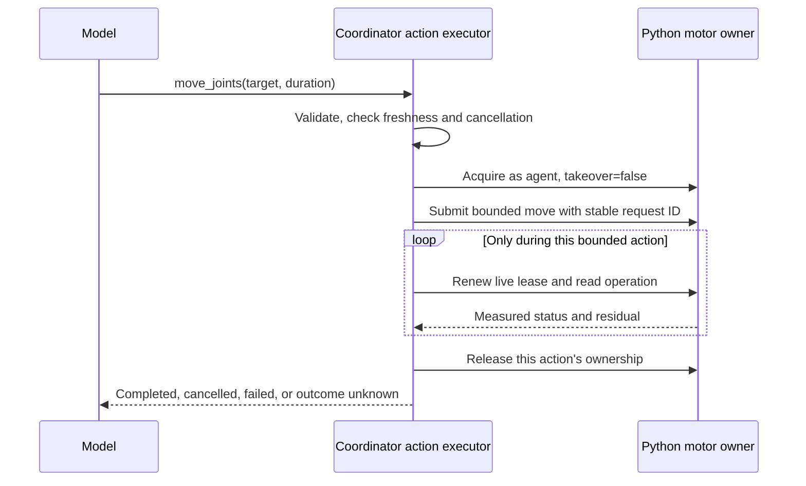

# Agent tool and motion review — 2026-09-08

The conversation exposes an interface problem: a language model is being asked to coordinate a three-second motor lease across inference rounds. The existing Python safety boundary is worth keeping. The chat interface needs to turn a bounded motion request into a supervised action that owns acquisition, renewal, completion, and cleanup.

This document is a review and implementation proposal. It does not accept an architecture decision or change deployed behavior.

**Evidence and scope**

Reviewed the saved Qwen3.8-Max conversation created at 00:30:44 on September 8, the coordinator chat loop, agent tools, protocol schemas, provider adapter, workbench rendering, Python lease/motion paths, and relevant fixtures. Times below are Europe/Berlin. Read installed AI SDK `7.0.79`, `@ai-sdk/openai-compatible` `3.0.37`, and Effect `4.0.0-rc.112` implementations; their APIs take precedence over older web examples. Initial inspection used `f2415db`. Concurrent reliability work was committed through `2490d29` during this review; the final validation used that tree plus this document. The chat, tool-schema, provider, and loop defects described here remain present.

The saved conversation continues beyond the pasted excerpt: it contains **16 acquire calls, 11 move calls, seven renew calls, and 26 tool errors**. None of the move calls returned success. Thirteen errors were displayed only as “Tool failed.” Transcript queries were read-only and excluded credentials and image payloads. Offline mock probes independently reproduced concurrent tool execution, string-valued SDK validation errors, and the JSON Schema/decoder mismatch. No paid provider calls or real-arm commands were needed.

| Time | Recorded evidence | Implication |
| --- | --- | --- |
| 00:31:19.365 → 00:31:31.138 | Acquire returns a 3,000 ms lease; the next move arrives about 11.8 seconds later with `duration_s: "1.5"`. | Both invalid input and an expired lease prevent progress. |
| 00:31:42.543 → 00:31:46.598 | Acquire succeeds; the following move has valid numeric duration but arrives about 4.1 seconds later. | Correct JSON alone cannot fix the interface. |
| 00:32:00.654–00:32:00.699 | Acquire, move, and renew are emitted together; move and renew fail before acquire returns. | A batch of dependent tool calls is not a sequential program. |
| 00:32:28.444 → 00:32:31.620 | A valid move is called about 2.7 seconds after acquire; Python subsequently rejects the lease. | Even a call beginning inside the TTL can lose its lease before planning/commit finishes. |

**Findings, in priority order**

1. **P1 — Acquisition occurs on the wrong side of the model round trip.** [chat-runs.ts](../apps/server/src/chat-runs.ts) instructs `acquire` followed by `move`. [tools.ts](../apps/server/src/tools.ts) begins its heartbeat only after `robot.move()` resolves. [robot.ts](../apps/server/src/robot.ts) refuses absent/expired controllers, and Python rechecks the lease before committing a planned motion. These checks explain the transcript and should remain. Making the TTL longer or renewing throughout an arbitrarily long chat turn would change the safety contract and conceal the architectural problem.

2. **P1 — Dependent mutations execute concurrently.** [loop.ts](../apps/server/src/loop.ts) supplies tools directly to `streamText` without a mutation admission policy. The installed SDK's `src/generate-text/execute-tools-from-stream.ts` executes pending calls through `Promise.all` after the model response finishes. A mock produced `acquire:start`, `move:owned=false`, `renew:owned=false`, `acquire:done`. Alibaba explicitly recommends serial execution for dependent calls. A provider flag can discourage batches, but coordinator enforcement must remain authoritative. [Alibaba function-calling guidance](https://docs.modelstudio.console.alibabacloud.com/en/model-studio/qwen-function-calling).

3. **P1 — Model-facing schemas and decoding disagree.** [packages/protocol/src/index.ts](../packages/protocol/src/index.ts) combines `Schema.optional` and decoding defaults. The generated `takeover` and `duration_s` schemas contain nested `anyOf` branches accepting `null`; the actual Effect decoder rejects `null`. Defaults and the joints/Cartesian exclusive-choice constraint are not clearly represented to the model. The shared acquire schema also offers `human`, `leader`, and `takeover`, although chat cannot use them. This adds avoidable choices and failure modes. The saved calls really contain strings such as `"false"` and `"1.5"`; the reviewed adapter/validation path provides no evidence of the harness converting valid booleans or numbers into those strings. The source of the provider/model's malformed arguments still needs a controlled conformance test.

4. **P2 — The operator sees less error information than the model.** In [chat-runs.ts](../apps/server/src/chat-runs.ts), `part.error instanceof Error ? part.error.message : "Tool failed"` discards string errors. The installed SDK's `stream-language-model-call.ts` deliberately emits invalid-input errors as strings. A mock confirmed this exact shape, with execution correctly skipped. The saved model history retains the useful validation message, so the model could see its type error while the human could not. The failure is diagnostic visibility, not missing validation.

5. **P2 — Vision capability is a provider-wide environment switch.** [providers.ts](../apps/server/src/providers.ts) sets all Alibaba models' vision flag from `ROBO_ALIBABA_VISION === "1"`. [tools.ts](../apps/server/src/tools.ts) then withholds images when the flag is false. The saved capture result proves this path was active. Alibaba's September 2 documentation lists `qwen3.8-max` as accepting images directly on Token Plan. This is evidence for correcting the capability catalog, although actual delivery through this account/endpoint still needs a smoke test. Segmentation/depth service configuration is separate from the chat model's image input capability. [Alibaba Token Plan vision support](https://www.alibabacloud.com/help/en/model-studio/add-vision-skill).

6. **P2 — Loop guards measure literal repetition better than failure to make progress.** [stop-conditions.ts](../apps/server/src/stop-conditions.ts) hashes full inputs/results. Changing request IDs changes call signatures; newly acquired lease IDs change result signatures. `resultChurn` reads successful `toolResults`, while execution/validation errors are separate SDK content parts. These guards cannot reliably recognize the acquire/expire/retry pattern in this incident. The last-step restriction in [loop.ts](../apps/server/src/loop.ts) is also only prose: the model can still call tools on that step.

7. **P2 — Motion completion and cancellation need one explicit lifecycle.** `moveToCompletion` suppresses renewal errors, can return an operation still running at its local deadline, and bypasses the initial abort check in `executeTool` through its special move branch. Robot HTTP requests have individual timeouts but do not receive the chat abort signal. These are code-path findings, not claims that this incident moved after cancellation. A replacement executor needs deterministic cancellation during acquisition, submission, polling, and cleanup, including late responses after a human stop or takeover.

**Proposed interface and execution behavior**

Keep the low-level protocol for manual controls and programmatic clients. Give chat a smaller facade built from the same joint names, bounds, and value schemas. Start with `observe`, `capture`, `move_joints`, and `stop`; offer recording, perception, shell, and reviewed Cartesian tools according to capability and task context. `activeTools` can reduce what the model sees, but execution authorization must independently enforce every restriction.

For this incident, a suitable proposed input is:

```json
{ "target": { "elbow_flex": 96.3 }, "duration_s": 1 }
```

This illustrates the recorded target, not a new command for the current robot pose. A future `jog_joint({joint, delta_deg})` can resolve a small relative move against a fresh measured observation, then pass the resolved absolute target through all existing bounds. Persist that resolved target with its operation identity so retries do not recompute another relative move.



The implementation should enforce these details:

- Acquire immediately before submission, with no model call in between. Start a deadline-bounded renewal task after acquisition so planning/submission is covered too. Renew deliberately only while this action is active; stop renewing on deadline, cancellation, ownership loss, or worker failure.
- Admit one motion action at a time. Reject additional same-response motion requests unless they belong to an explicitly supported, validated sequence. Parallel observation tools are fine. An operator stop must bypass the motion queue and invalidate pending agent work.
- Use an action/run generation or equivalent revocation check to reject stale queued work and late acquisition results after stop/takeover. Never automatically reacquire after ownership loss. Cleanup must address the action's own lease/operation and must not stop a human who has taken over.
- Generate a request ID in the coordinator once per admitted action, persist its resolved payload, and reuse it for transport retries. A lost submission response is an unknown outcome: reconcile the original request rather than issuing a fresh motion ID. A later model tool call is not automatically the same action.
- Return a measured terminal result including operation ID, target, final measured pose, residual, and reason. On timeout or uncertain submission, explicitly report uncertainty and stop renewal/clean up ownership. Do not label a running operation completed. Expose progress to the workbench during longer actions.
- Preserve Python's single motor writer, commissioned bounds, trajectory validation, maximum duration/step/speed, idempotency, three-second lease, and human takeover priority.

**Specific AI SDK changes**

The current `streamText`/`prepareStep` structure can support this. A migration to another agent framework is unnecessary to implement the proposal.

| Change | Installed API / implementation detail |
| --- | --- |
| Present simple, truthful tool inputs | Build the chat facade from shared Effect primitives. Use ordinary optional properties whose emitted JSON types match decoding; add required fields or explicit defaults as appropriate. Split joint and Cartesian tools. Test accepted/rejected JSON against both the advertised schema and decoder. Avoid a generic fallback that silently turns any non-object schema into an empty object. |
| Add concrete examples | Use `inputExamples` with `addToolInputExamplesMiddleware`, or put examples in descriptions. The installed compatible adapter forwards name, description, schema, and strictness, but not native input examples. [AI SDK example middleware](https://ai-sdk.dev/docs/reference/ai-sdk-core/add-tool-input-examples-middleware). |
| Discourage dependent batches | An offline fetch stub confirmed that this named compatible adapter sends `parallel_tool_calls: false` for `providerOptions: { alibaba: { parallel_tool_calls: false } }`. Verify endpoint behavior separately; keep coordinator admission rules even if the provider ignores the flag. This is not the same option shape as every provider-specific SDK. |
| Handle malformed inputs deliberately | Prefer correct schemas and a bounded re-ask. AI SDK 7 exposes `repairToolCall`; `experimental_repairToolCall` is its deprecated alias here. If compatibility normalization proves necessary, allow only explicitly specified, lossless conversions followed by full validation and an audit event. Never turn arbitrary truthy strings into booleans, infer units, clamp unsafe targets, or change ownership choices. |
| Gate tools and termination in code | Use `prepareStep`/`activeTools` for current capabilities and state. Reserve a final summary step with `toolChoice: "none"`. Count repeated structured failure codes and lack of measured progress, independent of changing IDs. Keep a total budget across steer rounds. [AI SDK tool-loop controls](https://ai-sdk.dev/docs/ai-sdk-core/tools-and-tool-calling). |
| Make failures reviewable | Handle string and object error variants through a bounded, redacted formatter. Store tool-call ID, step, operation ID, validated input, error code/path, and timing. The installed hooks are `onToolExecutionStart` and `onToolExecutionEnd`; invalid inputs also require handling the validation stream events because execution hooks never run for them. |

Strict tool generation is useful only after the advertised schemas are correct and support is verified for the chosen endpoint. It does not enforce physical safety. Keep the HTTP and Python motion contracts strict even if a narrow chat-only compatibility layer is introduced.

Model capability records should be keyed by provider, endpoint, and model, with separate values for image input, tool calling, tested strict generation, and supported provider options. Show effective image capability before the operator begins a conversation. Prefer direct image delivery for a verified vision-capable model; a separate vision model should be an explicit, budgeted fallback, not a silent model switch. Keep camera IDs, timestamps, freshness, and depth uncertainty attached to observations.

**Robotics examples worth borrowing**

| Primary example | Applicable pattern |
| --- | --- |
| [Boston Dynamics LeaseKeepAlive](https://dev.bostondynamics.com/python/bosdyn-client/src/bosdyn/client/lease.html) | Keepalive belongs to executable client control logic, with health callbacks and ownership-loss handling. For this harness, scope it to a bounded action rather than a whole model conversation. |
| [ROS 2 action design](https://design.ros2.org/articles/actions.html) | Separate goal acceptance, feedback, terminal result, and cancellation. The existing operation API already supplies much of this pattern; borrowing the semantics does not require adding ROS. |
| [SayCan](https://say-can.github.io/) | Select robot skills using both task relevance and feasibility. Here, expose actions grounded in current limits, ownership, calibration, and available perception. |
| [Code as Policies](https://code-as-policies.github.io/) | Let generated programs compose robot primitives for multi-step work. The existing isolated shell and Python client are a starting point, but every action must retain the same executor, capability limits, cancellation, and time bounds. Arbitrary generated code is not a safety layer. |

**Suggested implementation sequence and acceptance**

1. Correct tool error rendering and schema conformance, add typed examples, and make provider/model capabilities explicit. Add fixtures for strings, nulls, omitted defaults, exclusive targets, empty targets, and denied ownership fields. This removes misleading diagnostics before changing motion orchestration.
2. Implement the chat motion executor and reduce the chat-facing control surface. Test model delays of 1, 5, 15, and 30 seconds before tool invocation: each admitted action must acquire just before execution. Test dependent batches, duplicate calls, and stable operation IDs after lost responses.
3. Test cancellation before acquire, while acquire/submit is in flight, and during motion. Test human takeover during renewal, executor failure, and lease expiry. Assert no later agent reacquisition or queued motion after revocation, and preserve hold/torque semantics.
4. Add structured progress/failure guards and a provider conformance suite. Use offline recorded/mocked calls first, then a small explicitly budgeted endpoint check for numeric/boolean tool inputs and an identifiable image. Measure first-call validity, completed-action rate, calls per action, cancellation latency, and outcome correctness before deciding whether model replacement helps.

A concise expected experience is: the agent observes, requests one bounded motion, the workbench shows progress, and the agent reports the measured outcome. The operator should not have to debug lease choreography with the model.

**Validation during this review**

The existing focused loop, stop-condition, and protocol suites passed: 27 tests, 53 assertions. Offline probes reproduced the concurrency race, string-valued validation errors, and nullable-schema mismatch; an in-memory provider fetch stub also verified the proposed parallel-call option reaches the request body.

The first `bun run check:fast` attempt encountered three lint errors in concurrent sampling-test work. That work was subsequently corrected and committed independently. The final `bun run check` passed, including its fast gate, 58 Bun tests, and 45 Python tests; `bun run build` also passed. Existing transitional lint warnings, ten optional-import Pyright warnings, and two Python dependency deprecation warnings remain. These are mock/offline results, not an endpoint capability test or a physical-motion acceptance test. Only this review document was added by this review.
